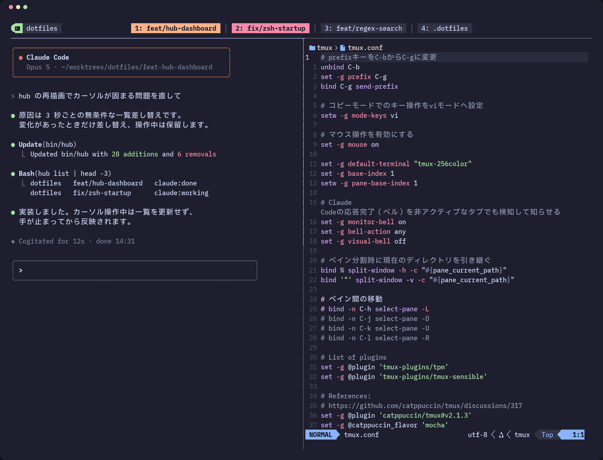
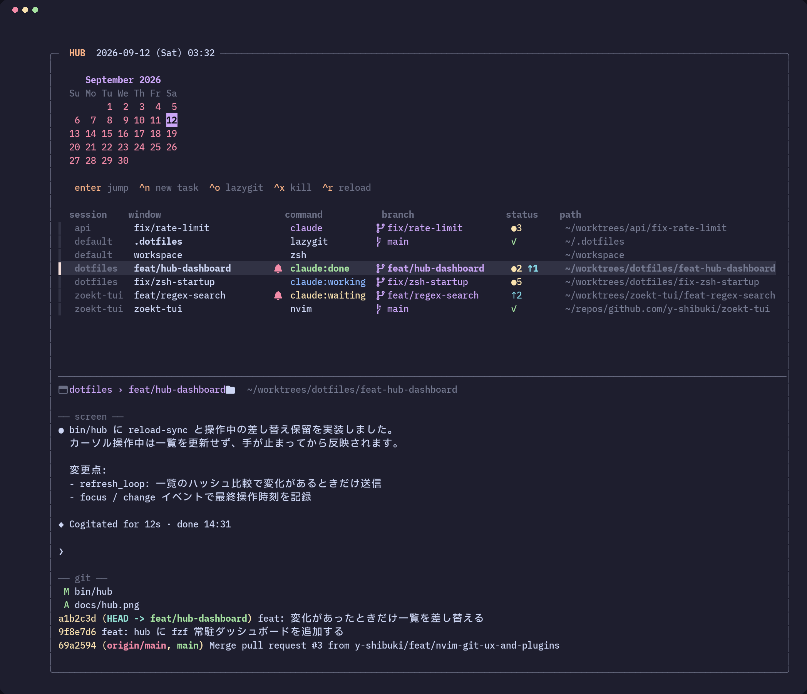

<div align="center">

# dotfiles

**Dotfiles for a comfortable terminal life — on macOS and WSL**

[](#getting-started)
[](#getting-started)
[](zsh/)
[](tmux/)
[](nvim/)
[](wezterm/)
[](claude/)

</div>

## Getting Started

```bash
git clone https://github.com/y-shibuki/dotfiles.git ~/.dotfiles
bash ~/.dotfiles/setup.sh
```

`setup.sh` は Homebrew と Brewfile のパッケージ導入、Starship と uv のインストール、zsh への切り替え、各設定ファイルのシンボリックリンク作成を行います。

ユーザー情報は`.gitconfig.local`に記載してください。

```bash
git config --file ~/.gitconfig.local --add user.name 'Your Name'
git config --file ~/.gitconfig.local --add user.email 'you@example.com'
```

### ローカル拡張

公開しない設定やスクリプトは `~/.dotfiles.local` に用意してください。`setup.sh` の実行時に自動で取り込みます。

| パス | 説明 |
| --- | --- |
| `skills/*/` | `~/.config/claude/skills` に Claude Code のスキルとしてリンクされる |
| `zsh/*.zsh` | zsh の起動時に読み込まれる |
| `hub-status` | 実行可能なら、出力が hub のヘッダーに表示される |

## Components

### zsh

Starship プロンプトに、fzf と ghq を組み合わせたシェル環境。

| コマンド | 説明 |
| --- | --- |
| `Ctrl-r` | 履歴を fzf で検索する |
| `repo` | ghq のリポジトリを fzf で選んで移動する |
| `repo-code` | ghq のリポジトリを fzf で選んで VSCode で開く |
| `repo-nvim` | ghq のリポジトリを fzf で選んで Neovim で開く |
| `repo-new <name>` | ghq 配下に新しいリポジトリを作る |
| `gtidy` | マージ済みブランチを確認して削除する |
| `lg` | lazygit を開く |
| `reload` | zsh と tmux の設定を再読込する |
| `brew-update` | Homebrew のパッケージを更新する |

### tmux

上部中央のステータスバーにウィンドウタブを並べるレイアウト。prefix は `C-g`。

<p align="center">
  
</p>

| キー | 説明 |
| --- | --- |
| `prefix + h` | hub セッションへ移動する |
| `prefix + j` | popup でウィンドウを選んでジャンプする |
| `prefix + g` | 現在のディレクトリで lazygit を popup 表示する |
| `prefix + %` / `"` | 現在のディレクトリを引き継いでペインを分割する |
| `prefix + r` | 設定を再読込する |

### hub

全 tmux セッションを横断し、ウィンドウ一覧・Claude Code の状態・git 差分を自動更新で表示するデスクトップ。

<p align="center">
  
</p>

| キー | 説明 |
| --- | --- |
| `hub` / `prefix + h` | hub セッションへ移動する（無ければ作成） |
| `Enter` | 選択したウィンドウへジャンプする |
| `Ctrl-n` | 新しいタスクを作る（`wt new`） |
| `Ctrl-o` | 選択したウィンドウのディレクトリで lazygit を開く |
| `Ctrl-x` | 選択したウィンドウを閉じる |
| `Ctrl-r` | 再読込する |

`command` 列は Claude Code の状態を `claude` / `claude:working` / `claude:waiting` / `claude:done` として色分け。`status` 列は `●N` が未コミットの変更数、`↑N` が未プッシュのコミット数。

### wt

ブランチ名をブランチ・worktree・tmux window・PR タイトルで統一し、1 タスクを 1 worktree で扱うライフサイクル。

| コマンド | 説明 |
| --- | --- |
| `wt new [slug] [repo-dir]` | 既定ブランチから slug ブランチと worktree を作り、リポジトリ名のセッションに window を開いて Claude Code を起動する |
| `wt pr` | ブランチを push して draft PR を作る |
| `wt done [slug] [--force]` | worktree と window を削除する |
| `wt clean` | 全 worktree を一覧し、複数選択して片付ける |
| `wt list` | worktree の一覧と状態を表示する |

## Layout

```
.
├── bin/            hub, wt
├── claude/         CLAUDE.md, settings.json, hooks/, skills/, agents/, statusline.sh
├── zsh/            .zshrc, modules/, starship.toml
├── tmux/           tmux.conf
├── nvim/           init.lua, lua/
├── wezterm/        wezterm.lua
├── git/            .gitconfig
├── vscode/         settings.json, extensions.txt
├── ruff/           ruff.toml
├── Brewfile
└── setup.sh
```
